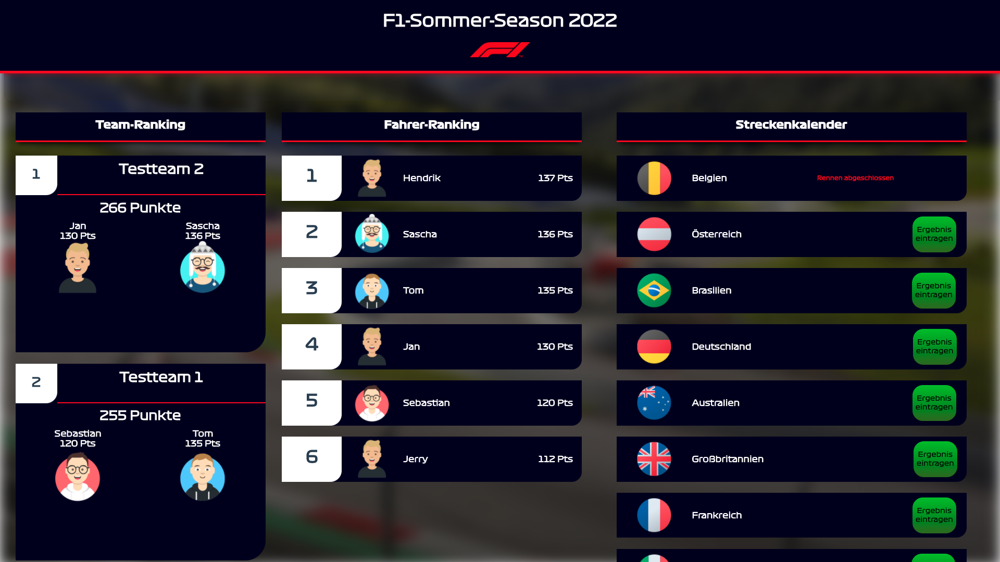

# Vue.Js F1 Scoreboard



# Starten der Komponenten
### Frontend:
```
npm i
npm run serve
```

### Datenservice:
In ./datenservice:
```
npm i
node index.js
```


Das Frontend wird zurzeit via Heroku bereitgestellt. 
Der Datenservice läuft auf einem RaspberryPi und ist via NoIp im Internet verfügbar.
